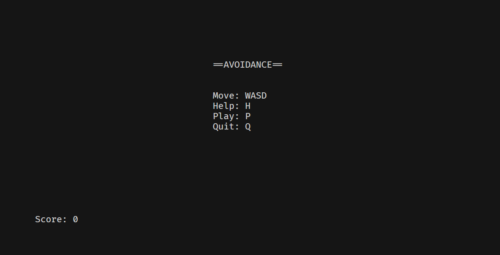
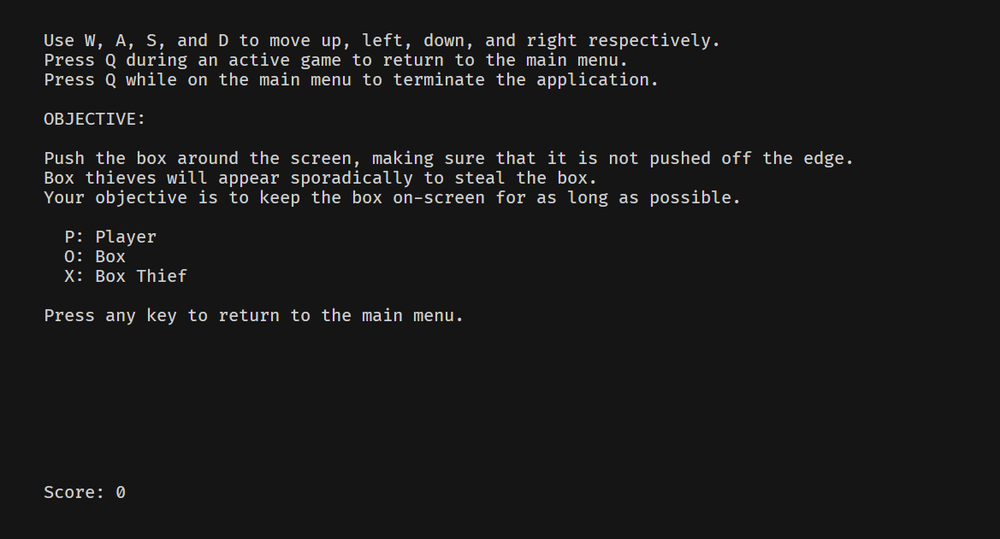
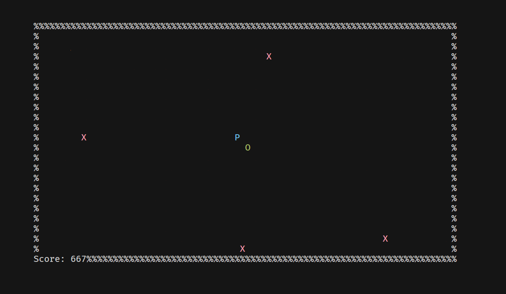

# AVOIDANCE

## Images

## Compilation instructions

* Install `stack` from https://docs.haskellstack.org/en/stable/README/#how-to-install
* Run `stack build` in the root directory of the repository
* Run `stack install` to copy the built executable to a location on your path

## How to run the game

Avoidance can be run from any ANSI terminal.
The terminal must be at least 80 columns wide and 24 rows high to fit the game.
If the terminal is too small, the game will print the following error:

    Please resize your terminal and relaunch the game!

To fix this issue, increase the terminal size and try to run Avoidance again.

## How to play the game

### Objective

Push the box around the screen, making sure that it is not pushed off the edge.
Box thieves will appear sporadically to steal the box.
Your objective is to keep the box on-screen for as long as possible.

Characters:

* `P`: Player
* `O`: Box
* `X`: Box Thief

### Controls

#### Title screen

* Start new game: `P`
* Quit game: `Q`
* Help screen: `H`

#### Game controls

* Move up: `W`
* Move down: `S`
* Move left: `A`
* Move right: `D`
* Abort game: `Q`
